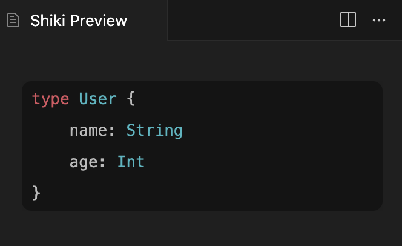

# `vscode-shiki-bridge`

🌉 Extracts the user's VS Code theme and language grammars for Shiki

## Why?

VS Code doesn't provide a built-in way to render syntax-highlighted code blocks in webviews that match the user's current theme and installed language extensions. This library solves that by extracting the user's VS Code configuration (themes & language grammars) and passing it to Shiki, so you can render code blocks that look exactly like the editor.

## Installation

```bash
npm install vscode-shiki-bridge shiki
```

## Usage

```typescript
import { createHighlighter } from "shiki";
import { getUserTheme, getUserLangs } from "vscode-shiki-bridge";

const [theme, themes] = await getUserTheme();
const { langs } = await getUserLangs(["graphql"]);
// Create Shiki highlighter with the extracted themes and langs
const highlighter = await createHighlighter({ themes, langs });

// Highlight GraphQL code with the user's theme
const html = highlighter.codeToHtml(
  `type User {
    name: String
    age: Int
}`,
  {
    lang: "graphql",
    theme,
  }
);
```

#### Results



### Examples
Check the [`example/`](./example/) directory for complete examples on how to use `vscode-shiki-bridge`.
To test the library, check out the repository and follow the instructions below

## Development and Debug

1. Open the project in VS Code / Cursor
2. install dependencies with `npm i`
3. Press `F5` to start debugging (opens a new VS Code window with the example extension)
4. Run the "Shiki Preview" command from the Command Palette to see your highlighted code blocks
5. Make changes and reload the window to test

## Documentation
See the [`docs/`](./docs/) directory for documentation on how this library bridges the gap from [VS Code Highlighting](https://code.visualstudio.com/api/language-extensions/syntax-highlight-guide) to Shikis [Custom Themes](https://shiki.style/guide/load-theme) and [Custom Languages](https://shiki.style/guide/load-lang).

## License

[MIT](./LICENSE)
