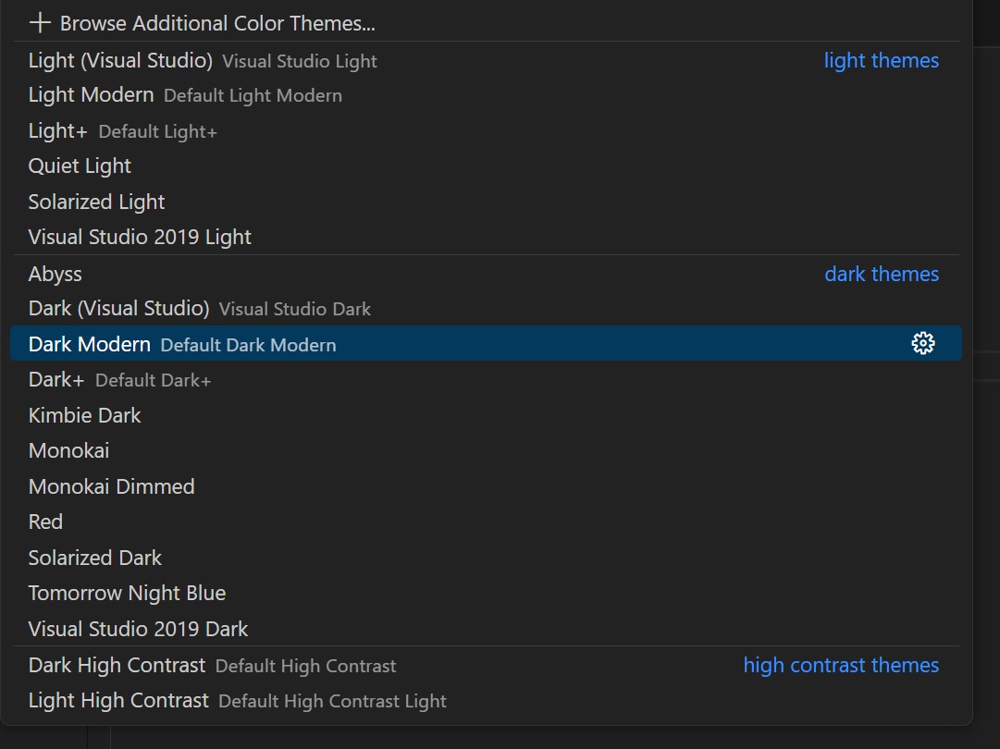
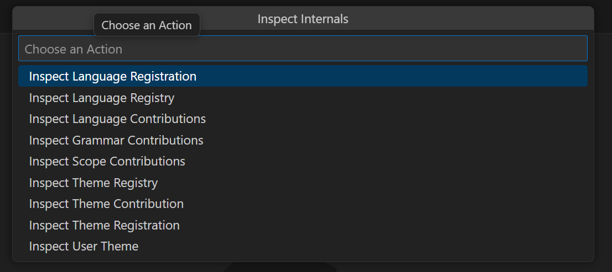

# `vscode-shiki-bridge` documentation

## Summary
Why this library exists:
- VS Code’s grammar/theme system is decentralized, mutable, and extension-driven.
- Shiki requires single finalized objects for grammars/themes.
- Bridging requires resolution, normalization, and dependency flattening.

## VS Code & Shiki
As per the [Shiki](https://shiki.style/guide/) documentation itself:
> Shiki (式, a Japanese word for "Style") is a beautiful and powerful syntax highlighter based on TextMate grammar and themes, the same engine as VS Code's syntax highlighting. Provides very accurate and fast syntax highlighting for almost any mainstream programming language.

VS Code uses [TextMate grammars](https://macromates.com/manual/en/language_grammars) in the [Oniguruma](https://github.com/kkos/oniguruma) dialect and wraps its engine (written in C) with:
- [`vscode-oniguruma`](https://github.com/microsoft/vscode-oniguruma)
- [`vscode-textmate`](https://github.com/microsoft/vscode-textmate)

Shiki has its own packages to harness this backend to implement the highlighter API Shiki provides:
- [`@shikijs/engine-oniguruma`](https://github.com/shikijs/shiki/tree/main/packages/engine-oniguruma) (wrapper of `vscode-oniguruma`)
- [`@shikijs/vscode-textmate`](https://github.com/shikijs/vscode-textmate) (fork of `vscode-textmate`)

This is what allows for the grammars and themes powering [VS Code syntax highlighting](https://code.visualstudio.com/api/language-extensions/syntax-highlight-guide) also to power highlighting with Shiki.

### The gap in between
This means there is a lot of overlap, but in practice there is still a gap to bridge to take the TextMate grammars from VS Code extensions and plug them into the Custom [Theme](https://shiki.style/guide/load-theme) and [Language](https://shiki.style/guide/load-lang) API of Shiki.

#### VS Code

VS Code uses the [`languages`](https://code.visualstudio.com/api/references/contribution-points#contributes.languages), [`grammars`](https://code.visualstudio.com/api/references/contribution-points#contributes.grammars)  and [`themes`](https://code.visualstudio.com/api/references/contribution-points#contributes.themes) contribution points in the [extension manifest](https://code.visualstudio.com/api/references/extension-manifest) to allow (built-in) extensions to define or augment grammars and themes.
This dynamic nature allows for new extensions to provide extra functionality on top of what other extensions already provide.

Sometimes an extension keeps it simple with accociating certain filenames or file extensions with a language id, to enable the correct highlighting for those files.

Other extensions will contribute more complex features like defining custom languages, embedded grammars, scope injection and adding new theme colors.

Themes for VS Code also have a few features which introduce complexity. Both features are not documented on the [docs](https://code.visualstudio.com/api/language-extensions/syntax-highlight-guide#theming), and will be explained [below](#bridging-the-gap).

This is great for a extension/plugin like architecture that VS Code uses, but also introduces where the gap lies between reading the grammar and themes from VS Code and passing them on to Shiki. The grammars and metadata from VS Code extensions are spread out over different extensions and have to resolved into a single interface that can be passed to the Shiki API. This is where `vscode-shiki-bridge` implements a bridge to cross that gap.

#### Shiki

Shiki does use the same grammar files, and even collects and provides a collection of them at the [`textmate-grammars-themes`](https://github.com/shikijs/textmate-grammars-themes) repository:

> Collection of TextMate [grammars](https://github.com/shikijs/textmate-grammars-themes/tree/main/packages/tm-grammars) and [themes](https://github.com/shikijs/textmate-grammars-themes/tree/main/packages/tm-themes), converted to JSON and re-distributed as npm packages. Extracted from Shiki, available for general usage.

But as seen in the the custom [Theme](https://shiki.style/guide/load-theme) and [Language](https://shiki.style/guide/load-lang) API of Shiki, these are provided as singular objects that define the whole theme or grammar.

Shiki **does not**:
- discover embedded languages automatically.
- apply VS Code’s scope injection rules.
- resolve theme inheritance or `tokenColors` indirection.

Themes are fairly simple, but languages can get complext by using embedded languages which can depend on external grammars. Because the Shiki API expects a single configuration object the caller is responsible for making sure embedded languages are resolved, and loaded into Shiki. If not, Shiki will throw an exception when it tries to highlight a piece of code that requires one of those embedded language grammars.

### Bridging the gap
Because of the plugable architecture VS Code uses, all extensions need to be checked for their contributions to `languages`, `grammars` and `themes`.
When calling `vscode-shiki-bridge` functions a registry will be build to resolve all spread out contributions to unqiue language and theme ids.
With these registries `vscode-shiki-bridge` is able to resolve any dependencies and can transform it into the singular objects that Shiki uses in its API.

#### Languages
Languages are what you care about when highlighting a piece of code. A language is represented by its [language identifier](https://code.visualstudio.com/docs/languages/identifiers) (e.g. `javascript`) and can have aliases (e.g. `JavaScript`, `js`). VS Code uses this identifier to map the different contributions like `grammars`, `snippets`, file accociations and many more to a singular id.

Shiki represents this with a `LanguageRegistration` object which is also unique based on its language identifier.
Because Shiki requires the the caller to ensure embedded languages and grammars are registered before using the highlighter, calling `getUserLangs(['<language>'])`, might return more language registrations than the one the caller requested.

A language can have multiple grammars, define embedded languages (e.g. `html` has `script` and `style` tags) and has some [declarative language features](https://code.visualstudio.com/api/language-extensions/language-configuration-guide) (e.g. line comments, block comments, brackets).

Most of the bridging of the language parts is the mapping of properties with different names:
- `folding.markers.start` to `foldingStartMarker`
- `folding.markers.end` to `foldingStopMarker`
- `displayName` to the first alias with an uppercase letter at the start (e.g. `python` to `Python`)
- `firstLine` to `firstLineMatch`

A few extra things that are done:

- Remove circular references of `aliases` (e.g. `javascript` aliases itself with `javascript`). These will cause Shiki to either throw
- The `LanguageRegistration` that is returned, has a few extra properties:
    - `filenames`
    - [`filenamePatterns`](https://code.visualstudio.com/docs/editor/glob-patterns)
    - [`extensions`](https://code.visualstudio.com/docs/languages/overview#_add-a-file-extension-to-a-language)
    - `mimetypes`

Note that because VS Code technically allows multiple extensions to define the same properties, it could happen that one extension overwrites a certain property.
In testing this never seems to happen, but if it does it will be logged (see [internals](#internals)).
If these properties have an array or object as value these values will merged.

#### Grammars
Grammars define a [TextMate language grammar](https://macromates.com/manual/en/language_grammars) and have some non text mate properties part of the grammar contribution. They are usually bound to a language identifier, with some exceptions. Grammars not tied to a language id are called 'orphaned' scopes in `vscode-shiki-bridge`. A good example is the [`text.html.basic`](https://github.com/microsoft/vscode/blob/main/extensions/html/package.json) scope. These are not bound to a language because they are so widely used in different types of grammars, you can think of them as an `abstract` type of grammar that other grammars can embed, but it is not intended to be used as a full language grammar on its own.

Both embedded languages and 'orphaned' scopes that the a requested language requires to be registered will be returned as an unique language registration that can be passed on to Shiki.

Bridging grammars contributions is mostly mapping properties:
- `balancedBracketScopes` to `balancedBracketSelectors`
- `unbalancedBracketScopes` to `unbalancedBracketSelectors`

A few extra things that are done:

- Remove circular references of `embeddedLangs` (e.g. `javascript` has marked itself as embedded language). These will cause Shiki to go into infinite recursion.

The 'raw' TextMate grammars are the only thing that can be passed straight to Shiki and no special bridging logic is needed.

#### Themes

A theme contribution can have an `id` and a `label` property, but the typescript types show both as optional, as does the json schema VS Code uses internally.
The example in the docs, the [extension sample](https://github.com/microsoft/vscode-extension-samples/blob/main/theme-sample) and the [yeoman generator](https://github.com/microsoft/vscode-generator-code) only use `label`.
The json schema describes the fields as:
```json
"id": {
    "description": "Id of the color theme as used in the user settings.",
    "type": "string"
},
"label": {
    "description": "Label of the color theme as shown in the UI.",
    "type": "string"
},
```

The menu in VS Code to switch themes uses a `<label> [<id>]` format.


All of this leads to the conclusion to use the `id` as an unique identifier and use the `label` as a string to show to the user. Since the occasional theme might only have a `label`, it will also be used as the `id`, if the property is missing.
If both are missing the theme contribution will be ignored.

Shiki uses the `name` and `displayName?` properties on its `ThemeRegistration` interface, thus `id` and `label` are mapped respectively to its Shiki counter parts.

VS Code themes are required to define a `uiTheme` property which is an enum of the following values:
- `vs` (light theme)
- `vs-dark` (dark theme)
- `hc-black` (high contrast dark theme)
- `hc-light` (high contrast light theme)

These are mapped to the Shiki property `type` of its `ThemeRegistration` interface like:
| Shiki | VS Code |
| --- | --- |
| `light` | `vs`, `hc-light` |
| `dark` | `vs-dark`, `hc-black` |

A theme configuration file can have an `include` property, which is a relative file path to another theme configuration file. This functions as a crude version of inheritance.
This feature is used in some of the default themes of the built-in [`theme-defaults`](https://github.com/microsoft/vscode/tree/main/extensions/theme-defaults/themes) extension of VS Code. Besides the `theme-defaults` there are several more [built-in extensions](https://github.com/microsoft/vscode/tree/main/extensions) (prefixed with `theme-`) that define one or more themes a user can use.

Another property that can be a relative file path is the `tokenColors` (aliased to the `settings` property in Shiki themes). This can either be the token color definitions, or a string, which would make it a relative file path to another file which defines the `tokenColors`.

> NOTE: this is only described in the `vscode://schemas/color-theme.json` file, but does not seem to be used by any built-in theme.

### Internals
There are a few internal functions exposed that are used in the [advanced example extension](../example/vscode-shiki-bridge-advanced-example-extension/). `vscode-shiki-bridge` also has a logger that will output useful information on how the bridging process runs from start to finish.

Both of these tools can be very useful if running into any issues with a specific language or theme. Note that the advanced extension should be run with the extensions enabled to make sure you get the all the contributions of your extensions.

#### Logger
The [`Logger`](../src/logger.ts) is used to be able to trace some of the harder parts of the bridging process. All logger calls use `trace` to make sure the lowest log level is used. The log output depends on the environment:
- Used as a library it will use [`vscode.window.createOutputChannel('vscode-shiki-bridge', { log: true })`](https://code.visualstudio.com/api/extension-capabilities/common-capabilities#output-channel). This allows for end users to provide additional information when something is not working.
- When running as part of one of the [example extensions](../example/) it will use the `console` object. This will write to any attached debugger and allow for the inspection of objects and their properties.
- If either of those can not be instantiaded a `no-op` logger is used which will make all log calls a no-op.

#### Inspect Internals
The advanced example extension provides the inspect internals command.



This provides helpful information about the internal state and output of `vscode-shiki-bridge.

##### Registry
Both the `language` and `theme` registries can be inspected, their contents will be serialised to (formatted) JSON and presented in a readonly editor.

#### Contributions
All `language`, `grammar` and `theme` contributions that extensions contribute can be inspected as (formatted) JSON and will be presented in a readonly editor

#### Registration
Both the `LanguageRegistration` and `ThemeRegistration` the `vscode-shiki-bridge` will return to the callers can be ispected as (formatted) JSON and will be presented in a readonly editor.

- Inspect Language Registration allows you to choose a language to inspect its registration
- Inspect User Theme allows you to inspect the theme registration of the currently active theme
- Inspect Theme Registration allows you to choose a theme to inspect its registration
